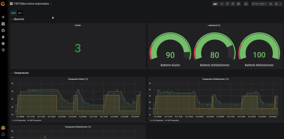

# FRITZ!Box Metrics Exporter
[](https://travis-ci.com/philippn/fb-metrics-exporter)

This repository contains a Spring Boot-powered Java application that can be used to export metrics regarding smart home devices directly attached to the FRITZ!Box into a Prometheus instance for further processing.

### Basic usage instructions
1. Build the app using Gradle
```
    gradlew bootJar
```
2. Copy the JAR file from `build/libs` to a suitable working directory
3. Start the application from the command line
```
    java -jar fb-metrics-exporter-x.y.z.jar --fritzbox.password=<the-password>
```
4. Add a new target to Prometheus pointing to `http://localhost:8080/prometheus`
5. Start scraping using Prometheus and configure a Grafana Dashboard to your liking

